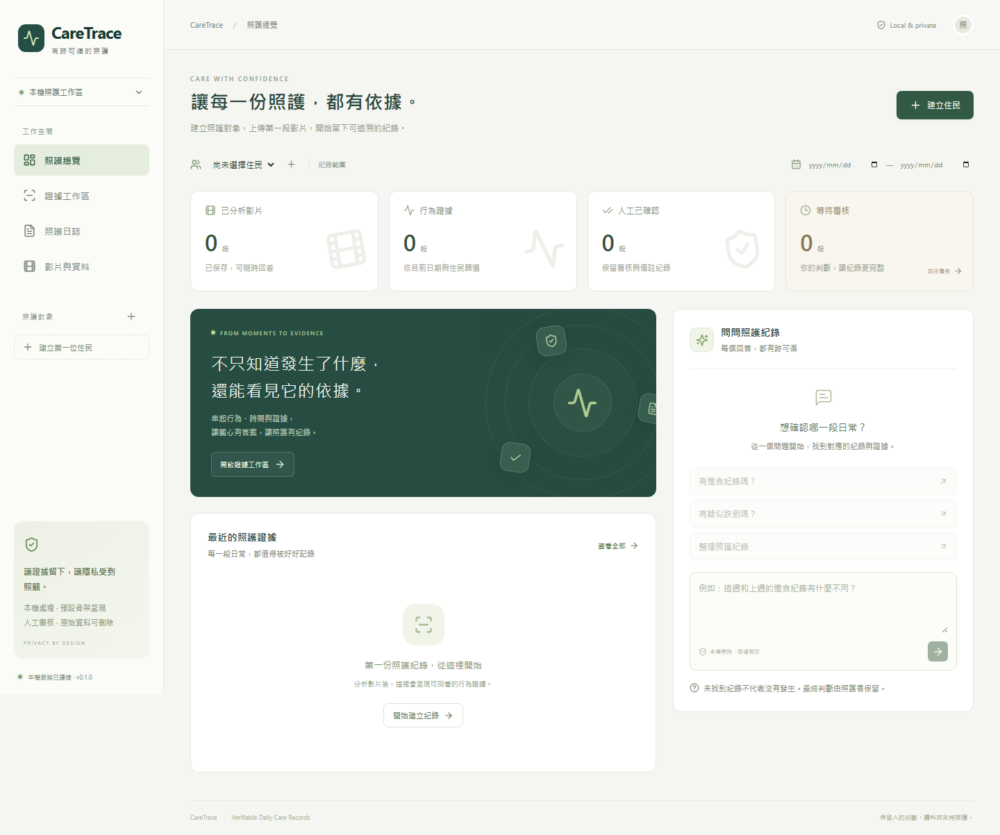

# CareTrace · 有跡可循的照護

本機運行的影片照護紀錄工作區：上傳影片、建立行為證據、自然語言查詢、點回時間戳，再由人員確認與註記。

採用既有 YOLOv8n-Pose、OmDet-Turbo 與本機 Qwen 模型，**不需要先訓練、不需要 API 金鑰**。前端為 React + TypeScript，後端為 Python / Flask，紀錄存入 SQLite。

**繁體中文 / English：** 按右上角 **English** 切換英文，再按 **繁體中文** 切回。視窗內也有切換按鈕。語言設定會保存在此瀏覽器，切換時保留未送出的表單、影片播放位置及既有查詢結果；住民姓名、備註和問題原文不會被翻譯。兩種語言共用所有功能，CSV 欄位與行為名稱跟隨目前語言，時間均顯示台灣時區（UTC+8）。

For English instructions, see [English usage guide](docs/usage-en.md).

v0.2.0 的中英文流程驗證見 [雙語驗收紀錄](docs/validation-bilingual.md)。



## 這台電腦直接啟動

在專案資料夾開啟 PowerShell：

```powershell
.\scripts\start.ps1
```

開啟 **http://127.0.0.1:5000**。停止服務按 `Ctrl+C`。也可直接啟動：

```powershell
.\.venv\Scripts\python.exe -m caretrace.app
```

## 另一台電腦安裝

需要 Python 3.10/3.11、Node.js 22+ 與首次下載模型的網路。

```powershell
.\scripts\setup.ps1
.\scripts\start.ps1
```

RTX 5090 電腦使用 `setup.ps1 -Cuda128`，再執行 `scripts/check_gpu.py` 驗證 CUDA。詳見 [5090 與訓練評估](docs/training-5090.md)。這次實測環境為 CPU，沒有執行 5090 訓練。

## 功能

- 住民代號、床位、照護背景與影片實際拍攝時間。
- 背景分析進度、失敗重試、重啟後紀錄保留。
- 站立、坐姿、躺臥、疑似跌倒、坐姿轉躺臥與進食候選。
- 骨架證據影片、行為時間軸、人工指定住民的追蹤代號。
- 中英文自然語言查詢、日期篩選、基本追問與週期間比較。
- 證據引用、人工確認／排除、備註與修改歷程。
- CSV / JSON 匯出、原始影片及相關紀錄刪除。
- 桌機、平板與手機版面；模型備援、空結果與錯誤均明確呈現。

**使用流程：** 建立住民 → 上傳影片並設定拍攝時間 → 等待分析 → 確認追蹤對應 → 提問與回看 → 人工覆核 → 匯出日誌。

這是經功能測試的本機展示版本。候選事件與模型分數不能代替人工判讀；未偵測到事件不代表事件沒有發生。進食線索不能證明攝取量，也不根據沒有告警就推論健康狀態正常。

## 測試

```powershell
.\.venv\Scripts\python.exe -m pytest
cd frontend
npm.cmd run build
cd ..
.\.venv\Scripts\python.exe -m playwright install chromium
.\.venv\Scripts\python.exe scripts\e2e.py
.\.venv\Scripts\python.exe scripts\validate_models.py
```

`e2e.py` 使用本機的 `test_videos/fall_event.mp4` 跑真實模型與瀏覽器。`validate_models.py` 分析本機測試資料夾中的影片。兩者將私人測試產物寫入被 Git 忽略的 `artifacts/`；沒有影片的新 clone 應自行提供素材。GitHub CI 執行純邏輯／API 測試與前端建置，不冒充真實模型測試。

詳見 [測試報告](docs/validation.md)、[操作與疑難排解](docs/operations.md)、[架構與需求對照](docs/architecture.md)。

## 目錄與版本

| 路徑 | 用途 |
| --- | --- |
| `caretrace/` | API、資料庫、預訓練推論、查詢規劃 |
| `frontend/` | React 網頁；`package-lock.json` 固定依賴 |
| `tests/` | 邏輯、隔離、匯出、生命週期回歸測試 |
| `scripts/` | 安裝、啟動、硬體檢查與驗收；原實驗腳本亦保留 |
| `data/` | 私人資料庫、影片、證據與模型快取，不上傳 Git |
| `docs/` | 操作、需求、測試及訓練評估 |

原始雛形保存在 `v0.0.0-prototype`；新版以功能提交、開發分支與 `v0.1.0` 標籤追蹤。`webapp/app.py` 是新版的相容啟動入口，舊 HTML 模板不再使用。

模型與第三方套件維持各自授權條款；本專案沒有重新授權其權重。公開儲存庫不包含照片、影片、照護資料或模型。
