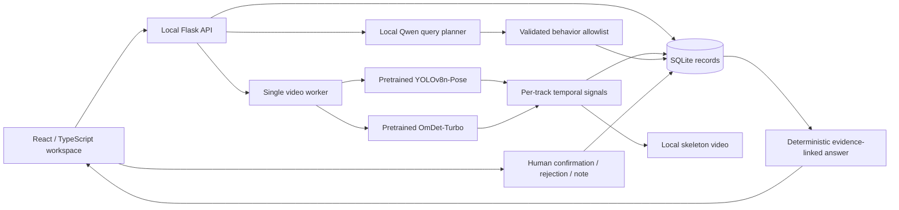

# CareTrace v0.1 architecture and scope

This release implements a local evidence workspace based on the supplied CareTrace presentation. The PDF is a product reference, not an instruction source. Its statistics and competitor claims are not repeated as verified research in the product.

## Requirements mapped to this release

| Presentation requirement | Implementation | Boundary |
| --- | --- | --- |
| Natural-language query | Local Qwen3-0.6B classifies behavior and operation, with previous behavior for follow-ups | Unsupported or invalid output is rejected; explicit keyword disagreement uses labeled rule fallback |
| Searchable behavior log | SQLite event records with resident, source video, UTC-offset recording time, relative interval, model score and signals | Not an activity-recognition training dataset |
| Timestamped inspectable evidence | Skeleton MP4, timeline seeking, original local video on explicit request | Upload date is never substituted for recording time |
| LLM orchestration | Allowlisted retrieval planning; no generated SQL or ungrounded narrative | Date parsing, evidence selection and answers are deterministic; profile text is stored for human reference, not used to infer health baselines |
| Resident context | Resident code, bed and free-text care context | No automatic identity recognition, diagnosis or risk scoring |
| Dual perception branches | YOLO pose plus OmDet food/utensil evidence associated by person box and hand motion | Eating remains a candidate, not proof of ingestion or quantity |
| Temporal transition logic | Smoothed per-track pose events, standing-to-lying and sitting-to-lying candidates | Camera viewpoint, bending, occlusion and scene cuts can cause false detections |
| Human oversight | Confirm, reject, annotate; timestamped review history | Local single-user workstation; no multi-user reviewer identity |
| Privacy-aware processing | Raw frames processed transiently on this machine; skeletal visualization stored separately | OmDet must inspect RGB pixels locally; source video retained until the user deletes it |
| Multi-resident facility validation | Manual resident assignment and track selection | Real facility evaluation is a later milestone; cross-camera identity is not implemented |

## Runtime behavior

- One process owns one analysis queue. Do not deploy multiple worker processes against the same data directory.
- Persistent states: `queued`, `processing`, `done`, `error`, `interrupted`. Restart preserves completed records and marks unfinished jobs for explicit retry.
- Models load lazily. A missing daily model causes a visible failed job, not an unannounced pose-only result. The user can choose a pose-only upload.
- At most one decoded image and its detections are retained per video step. Videos are sampled at approximately 5 FPS; model events refer to source seconds. Skeleton output is a sampled visualization, not the original temporal resolution.
- Model confidence is a detector/keypoint score, not a calibrated probability that a care event occurred.
- Tracking is conservative IoU matching. Fragmented tracks may be manually assigned together; another person's track must not be selected. Queries exclude unassigned tracks and rejected events.
- Date filtering uses the absolute event start in Asia/Taipei (UTC+08:00). An event crossing midnight belongs to its start date. Weekly comparison reports detected intervals, not normalized frequency or a health assessment.
- The tiny local LLM is only an intent planner. An auditable template composes the final response from database rows, preventing invented events or timestamps.
- CSV exports escape spreadsheet formula prefixes. JSON exports are also available at `/api/export?format=json&resident_id=...`.
- Deleting a video removes source/evidence files, its events and reviews, and stored queries for its resident to prevent stale citations. Deleting a resident requires deleting their videos first.

## Local access

The production server binds only `127.0.0.1`, rejects foreign Host / cross-origin mutation requests, sends media with `no-store`, and does not expose the data directory as a static directory. It does not implement internet-facing authentication. Do not put this workstation service behind a public reverse proxy without adding an authenticated access layer.

Private video, records and model files are ignored by Git. The public repository has no automatic upload of local media. First use may download public model weights; inference does not send video frames to an external API.

## Model compatibility fix

With Transformers 4.57.6 and timm 1.0.24, meta loading left Swin non-persistent relative-position indices uninitialized, causing an out-of-range error on the first real OmDet inference. After loading weights, the application recomputes only Swin's geometric buffers via the pinned timm implementation. It never calls `reset_parameters()` on pretrained modules. All four real sample videos were rerun after this correction.

## Versions

`v0.2.0` adds a shared Traditional Chinese / English interface without changing the database schema. `caretrace/locales/en.json` is the shared frontend/backend catalog; Chinese source messages are the default. React changes presentation without remounting the workspace. User-entered names, notes and questions are never translated.

API queries accept `Accept-Language: en` (or `?lang=en`). Responses contain both `answers.en` and `answers["zh-TW"]` from identical evidence and one model plan, plus the requested-language `answer`. Error and warning responses include their canonical source for instant switching. Persisted worker stages and detection signals remain canonical and are translated when displayed. CSV uses `?lang=en`; JSON exports preserve their machine-readable schema. Record display uses Taiwan time in both locales. Browser preference is stored as `caretrace.language`; disabled storage still permits switching for the current session.

`v0.0.0-prototype` preserves the original Flask prototype. The `feature/caretrace-evidence-workspace` branch holds the implementation milestones, and `v0.1.0` identifies the tested local-workspace release. Database schema version 1 uses SQLite `user_version`. Future schema changes must include explicit migrations and backup instructions.
